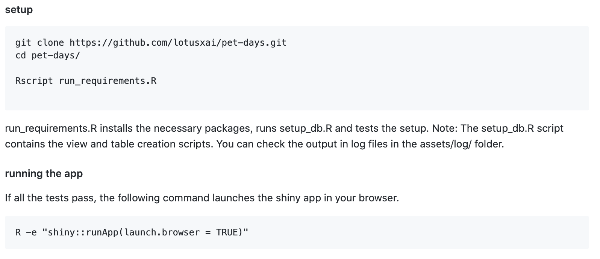

```{r setup, include=FALSE}
knitr::opts_chunk$set(echo = TRUE, eval = FALSE)
#toprint pdf - pagedown::chrome_print("refactor-slides.Rmd")
```

## An R Shiny Application 

Web Page powered by an R session

  
  
  
shinyapps.io - host your apps 

[Shiny Gallery](https://shiny.rstudio.com/gallery/dog-medical-history.html)


---

## Inspiration: Refactoring an RShiny app


- Data Analysis is highly interactive but also collaborative

- Tools like RShiny are great for prototyping but can quickly become complex 

--

Helps to follow a process

- Small changes to structure code effectively

- Done before adding new features or after a release

--

  >  Inputs mapped to  
    Outputs  
    Flow between modules


---

## Running the App

We should ideally be able to run the code directly from [GitHub forked repo](https://github.com/NadiaAntony/pet-days/tree/400b74228f873bdcd3b766c7116b823ba2e1656b)

  

--

So does this work?

```{r, eval=FALSE}
shiny::runGitHub("NadiaAntony/pet-days", subdir = "pet-records-app", ref = "400b74228f873bdcd3b766c7116b823ba2e1656b")
```

--
```r
Error in library(fs) : there is no package called ‘fs’
```
--

install the required package on my local using `install.packages()` and then try another run:

--
```r
Error : no such table: dimPets
```
--

---

## Primary Tasks

- mental model of architecture

--

- dummy data using data model provided  
  

--

- setup script to propagate the data to SQLite DB 
setup_db.R [commit#](https://github.com/NadiaAntony/pet-days/commit/ccec8692aec467c91aa416c60eef58378d9b9660) 

--

- setup script to provide a `requirements.txt`, and install packages if missing
run_requirements.R [commit#](https://github.com/NadiaAntony/pet-days/commit/6d1dbd53650f768d32774702ac61047a43379be4#diff-db56b409c6f8ac594facc3055977bd1cR20)  


---

## Output

  

---

## Reinforcing Primary Tasks

Reinforce these changes through 

- setup instructions and documentation in the README

      

- unit tests

- logging 

- continuous integration

---

## Unit Testing

Test Expected Outputs:

>Function outputs are checked using `testthat` package

test scripts created for:
- installing and loading all libraries
- data propagation, reading and loading [commit#](https://github.com/lotusxai/pet-days/pull/24/commits/acf05d99365dcdf47e1688ed9a74be41ef35bb9f)

--

tests called after setup_db.R in run_requirements.R [commit#](https://github.com/lotusxai/pet-days/pull/24/commits/aa2a26130aee9bc662c6cf0cd9be0dd9c90fc688)

--
## Log file

Simple logging of the run_requirements file if done using the sink() command to redirect outputs. 

```{r}
logfile <- file(file.path(logs_dir, "run_requirements.log"), open = "at")
sink(logfile, append = TRUE, split = TRUE, type ="output")
```
--

---

## Next Steps

- Using browser() to debug issues like Invisible UI Outputs  
  

- Shiny best practices and modularizing code

- Adding in enhancements, e.g, data writes from the app

---

class: middle

## Thank You!

Find me on 

- GitHub: [github.com/NadiaAntony](https://github.com/NadiaAntony)

- LinkedIn: [linkedin.com/in/nadiaantony](https://www.linkedin.com/in/nadiaantony/)

- Medium/Twitter: [@NadiaAntony](https://medium.com/@NadiaAntony)

---

## Appendix: CI using Travis

Build config file = 
.travis.yml

```r
language: r

warnings_are_errors: false
cache: packages

script:
    - R -f run_requirements.R
```
